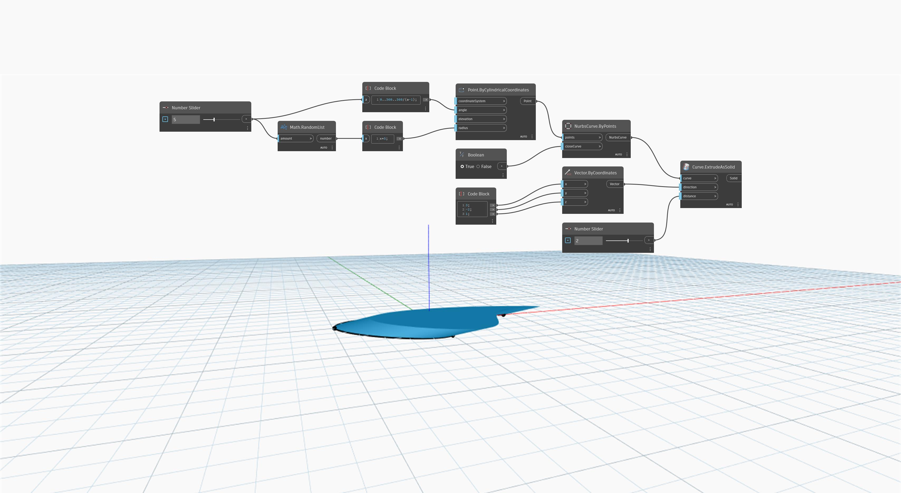

<!--- Autodesk.DesignScript.Geometry.Curve.ExtrudeAsSolid(curve, direction, distance) --->
<!--- EXQDCVFI3OT5SKR7TAAZHHPRQTFTGPSESCN2SXOJLSORL2ATIOCA --->
## 详细
`Curve.ExtrudeAsSolid (direction, distance)` 使用输入向量拉伸输入的闭合平面曲线以确定拉伸的方向。一个单独的 `distance` 输入用于拉伸距离。此节点对拉伸的末端进行封口以创建实体。

在下面的示例中，我们先使用 `NurbsCurve.ByPoints` 节点(其中一组随机生成的点作为输入)创建 NurbsCurve。一个 `code block` 用于指定 `Vector.ByCoordinates` 节点的 X、Y 和 Z 分量。然后，此向量用作 `Curve.ExtrudeAsSolid` 节点中的 `direction` 输入，而一个数字滑块用于控制 `distance` 输入。
___
## 示例文件

