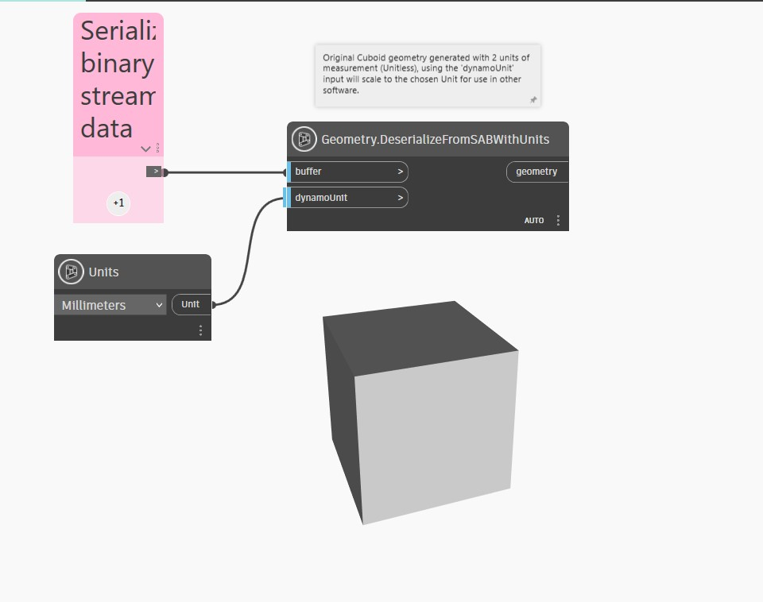

## 详细
`Geometry.DeserializeFromSABWithUnits` 将几何图形从 .SAB (标准 ACIS 二进制)字节数组和可转换自毫米的 `DynamoUnit.Unit` 输入到 Dynamo。此节点接收 byte[] 作为第一个输入和 `dynamoUnit` 作为第二个输入。如果 `dynamoUnit` 输入保留为空，则此节点会以无单位形式输入 .SAB 几何图形(即输入数组中的几何数据，而不转换任何单位)。如果提供单位，则 .SAB 数组的内部单位会转换为指定的单位。

Dynamo 是无单位的，但 Dynamo 图形中的数值可能仍具有某种隐式单位。可以使用 `dynamoUnit` 输入将 .SAB 的内部几何图形缩放到该单位制。

在下面的示例中，一个立方体生成自 SAB，有 2 个测量单位(无单位)。`dynamoUnit` 输入缩放所选单位以用于其他软件。

___
## 示例文件

