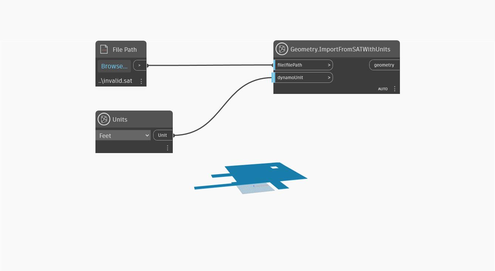

## 详细
`Geometry.ImportFromSATWithUnits` 将几何图形从 .SAT 文件和可转换自毫米的 `DynamoUnit.Unit` 输入到 Dynamo。此节点接收文件对象或文件路径作为第一个输入和 `dynamoUnit` 作为第二个输入。如果 `dynamoUnit` 输入保留为空，则 .SAT 几何图形会以无单位形式输入(即仅输入文件中的几何数据，而不转换任何单位)。如果传递单位，则 .SAT 文件的内部单位会转换为指定单位。

Dynamo 是无单位的，但 Dynamo 图形中的数值可能仍具有某种隐式单位。可以使用 `dynamoUnit` 输入将 .SAT 的内部几何图形缩放到该单位制。

在下面的示例中，几何图形输入自 .SAT 文件，单位为英尺。要使此示例文件能够在您的计算机上使用，请下载此示例 SAT 文件，然后将 `File Path` 节点指向 invalid.sat 文件。

___
## 示例文件

