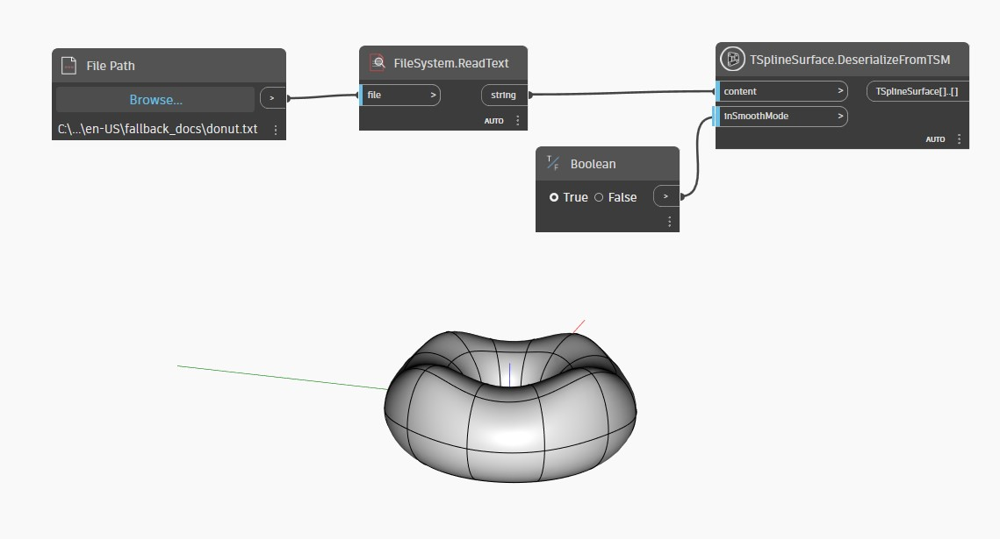

<!--- Autodesk.DesignScript.Geometry.TSpline.TSplineSurface.DeserializeFromTSM --->
<!--- HBD752E5KQ2LBVQYS575OP546LHHTXJCD4I2NUKGZV4QDHJLBMMQ --->
## 详细

在下面的示例中，使用 `TSplineSurface.DeserializeFromTSM` 节点以 TSM 格式重新构造一个 T-Spline 曲面。文本文件是以前使用 `TSplineSurface.SerializeAsTSM` 节点创建的。
___
## 示例文件

