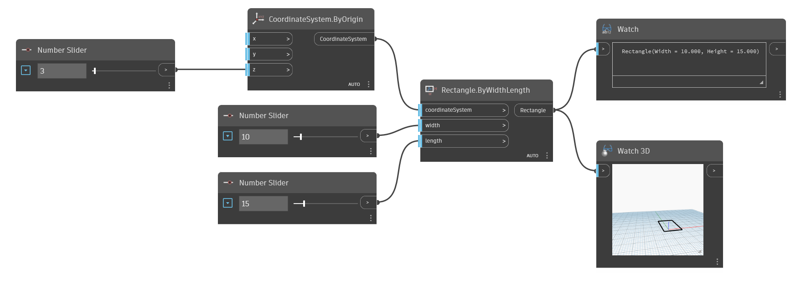

<!--- Autodesk.DesignScript.Geometry.Rectangle.ByWidthLength(coordinateSystem, width, length) --->
<!--- LMVGRWYVOONMRPCSD3NCYVD776V33DFYWXC2F5S3KREHPOX5A2FA --->
## 详细
“Rectangle.ByWidthLength”将在给定坐标系处以给定宽度/长度创建一个矩形。如果移动输入坐标系，则该矩形也将根据坐标系移动。
___
## 示例文件

