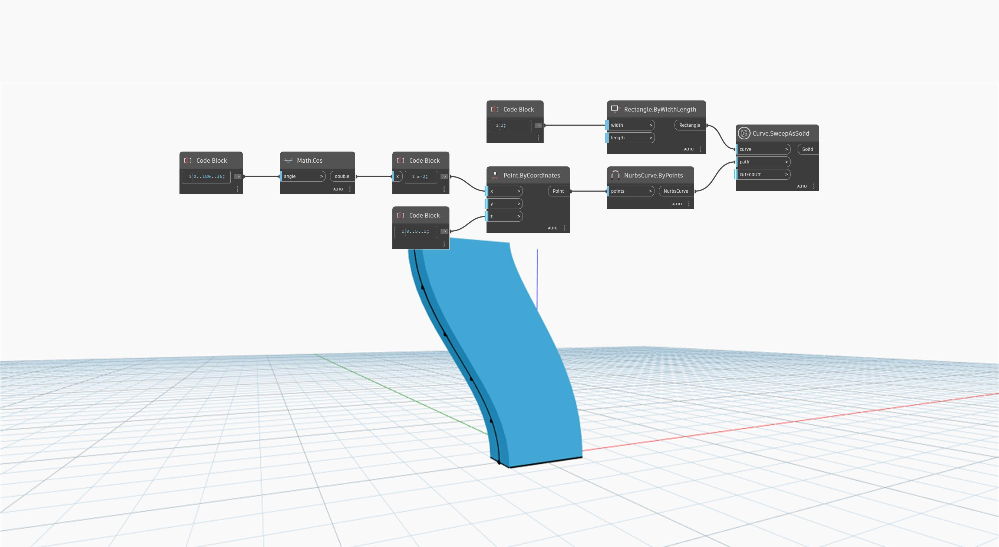

<!--- Autodesk.DesignScript.Geometry.Curve.SweepAsSolid(curve, path, cutEndOff) --->
<!--- LUVHU25JWECNEBKIBZFH6N5EUAM42XM3BSEOTMCI3TQDNS5EKLXA --->
## 详细
`Curve.SweepAsSolid` 通过沿指定路径扫掠输入的闭合轮廓曲线来创建实体。

在下面的示例中，我们使用一个矩形作为基本轮廓曲线。通过使用余弦函数和一系列角度来改变一组点的 x 坐标以创建路径。这些点用作 `NurbsCurve.ByPoints` 节点的输入。然后，我们通过使用 `Curve.SweepAsSolid` 节点沿已创建的余弦曲线扫掠矩形来创建实体。
___
## 示例文件

