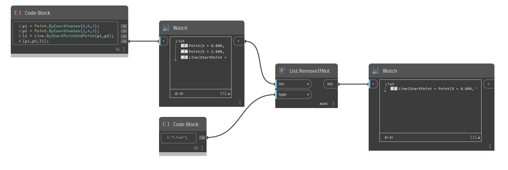

## 详细
`List.RemoveIfNot` 返回一个列表，其中保留与给定元素类型匹配的列表项并删除原始列表中的所有其他项。

可能需要在 `type` 输入中使用完整节点路径(如 `Autodesk.DesignScript.Geometry.Surface`)来删除列表项。要检索列表项的路径，可以将列表输入到 `Object.Type` 节点中。

在下面的示例中，`List.RemoveIfNot` 通过从原始列表中删除点元素(因为它们不匹配指定类型)，返回一个包含一条线的列表。
___
## 示例文件

