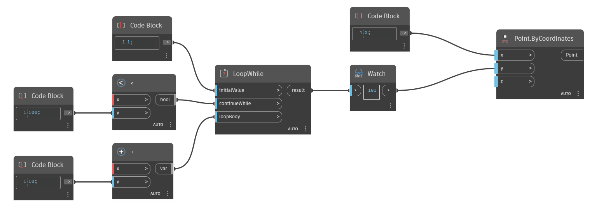

## 详细
`LoopWhile` 将在满足约束条件后返回循环函数的结果。

在下面的示例中，创建了一个简单循环: 从 1 开始加 10，直到结果大于 100。`LoopWhile` 接受其 `initialValue` 输入的变量，并接受 `continueWhile` 和 `loopBody` 输入的函数。`continueWhile` 定义循环的约束条件(在本例中是 `Less Than` 函数，参数为 100)。`loopBody` 定义循环执行的操作(在本例中是 `Add` 函数，参数为 10)。
___
## 示例文件

