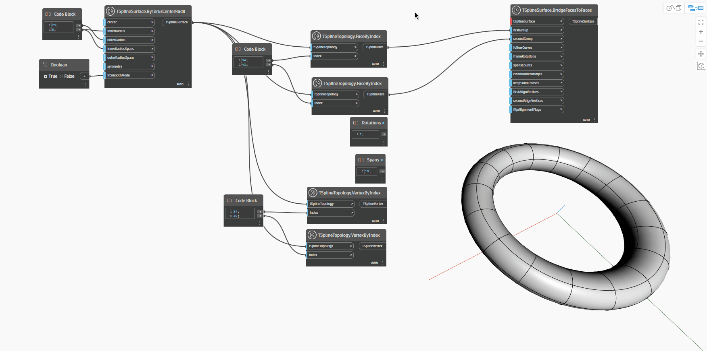

<!--- Autodesk.DesignScript.Geometry.TSpline.TSplineSurface.BridgeFacesToFaces --->
<!--- MQJ667AXSQFCK2Z2B7G2MNL35OIFJYLSADFLGXFJUJCA27FCHVHQ --->
## 详细
`TSplineSurface.BridgeEdgesToFaces` 连接两组面，这些面来自同一个曲面或两个不同的曲面。该节点需要如下所述的输入。前三个输入足以生成桥接，其余输入是可选的。生成的曲面是第一组边所属曲面的子曲面。

在下面的示例中，使用 `TSplineSurface.ByTorusCenterRadii` 创建一个圆环体曲面。选择它的两个面，并将其以及圆环体曲面用作 `TSplineSurface.BridgeFacesToFaces` 节点的输入。其余输入说明如何进一步调整桥接:
- `followCurves`: (optional) a curve for the bridge to follow. In the absence of this input, the bridge follows a straight line
- `frameRotations`: (optional) number of rotations of the bridge extrusion that connects the chosen edges.
- `spansCounts`: (optional) number of spans/segments of the bridge extrusion that connects the chosen edges. If the number of spans is too low, certain options might not be available until it is increased.
- `cleanBorderBridges`: (可选)删除边界桥接之间的桥接以防止锐化。
- `keepSubdCreases`: (可选)保留输入拓扑的细分锐化，以对桥接的起点和终点进行锐化。圆环体曲面没有锐化边，因此此输入对形状没有影响。
- `firstAlignVertices` (可选)和 `secondAlignVertices`: 通过指定偏移的一对顶点，桥接获取轻微旋转。
- `flipAlignFlags`: (optional) reverses the direction of vertices to align

## 示例文件

