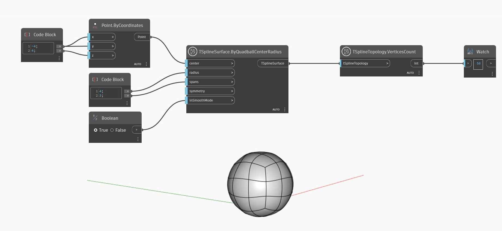

<!--- Autodesk.DesignScript.Geometry.TSpline.TSplineTopology.VerticesCount --->
<!--- OUBDJTXQVGIEZZTOCO3QDFCDT73JUQD54U6YYFBJZUKZDZEYPYKA --->
## 详细
在下面的示例中，`TSplineTopology.VerticesCount` 节点用于返回四分球 T-Spline 曲面的顶点数。
___
## 示例文件

