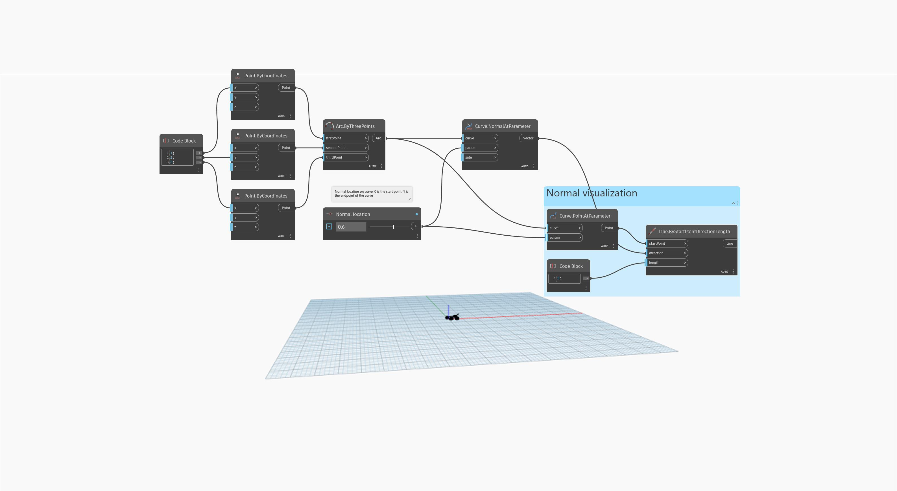

<!--- Autodesk.DesignScript.Geometry.Curve.NormalAtParameter(curve, param, side) --->
<!--- PEZAIOOYHWK3SBHRTJTFKB4CTMRQFK7MX4N6YFCSNPDG5ICCLYBQ --->
## 详细
`Curve.NormalAtParameter (curve, param, side)`
___
## 示例文件

