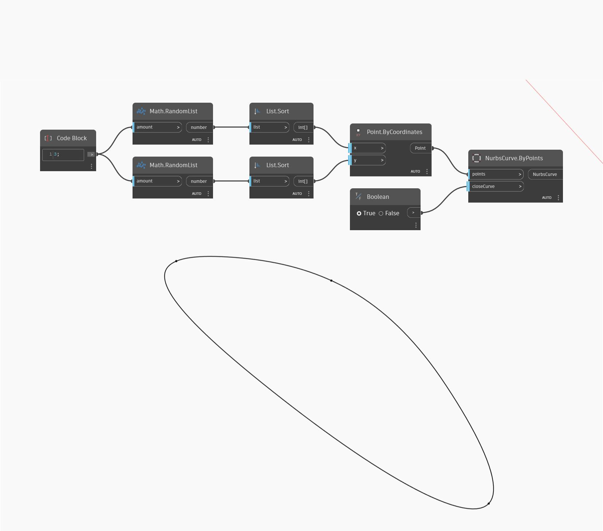

<!--- Autodesk.DesignScript.Geometry.NurbsCurve.ByPoints(points, closeCurve) --->
<!--- R56RKDC3YJDKDO3WMJD2V4SIMHIJCNVQ6PZV7SMATQASDKE7WEMA --->
## 详细
“Nurbs Curve By Points”将输入点列表以绘制一条 Nurbs 曲线，还允许我们闭合曲线。本例在世界 XY 平面上生成四个随机点，然后在 X 和 Y 方向上依次连接它们，从而将曲线闭合回列表中的第一个点。
___
## 示例文件

