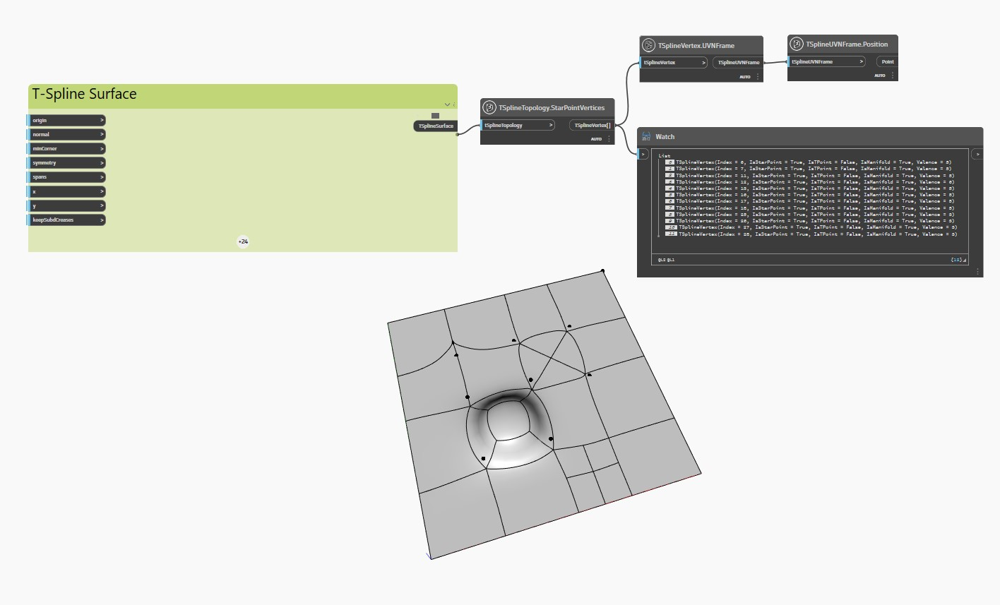

<!--- Autodesk.DesignScript.Geometry.TSpline.TSplineTopology.StarPointVertices --->
<!--- RMKGTFPZFLM5GGB475DWTHXFTJCBZQXE2HEVNUZA6OS72LH53HVQ --->
## 详细
在下面的示例中，使用 `TSplineTopology.StarPointVertices` 节点检查具有拉伸、细分和拉动顶点和面的平面 T-Spline 曲面，以检查其任何顶点是否是星形点。

`TSplineVertex.UVNFrame` 和 `TSplineUVNFrame.Position` 节点用于亮显曲面的星形点。
___
## 示例文件

