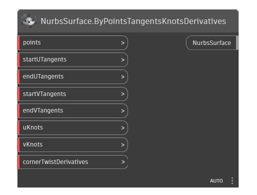

<!--- Autodesk.DesignScript.Geometry.NurbsSurface.ByPointsTangentsKnotsDerivatives --->
<!--- RV2SASIKSEDOUBHRUROUQ4CVIRQAGMTKGBFMRRLXVRULYUOVADQQ --->
## 详细
创建满足一组不同曲面特性条件的 NurbsSurface。这是最高级曲面拟合方式。生成的曲面将通过所有点。切线的数量必须与相应方向上的点数量匹配。生成的曲面在 U 和 V 方向上的阶数都将为 3。角导数应为二阶(dP/dUdV)，并应按以下顺序提供: [lowU, lowV]、[highU, lowV]、[lowU, highV]、[highU, highV]。
___
## 示例文件

