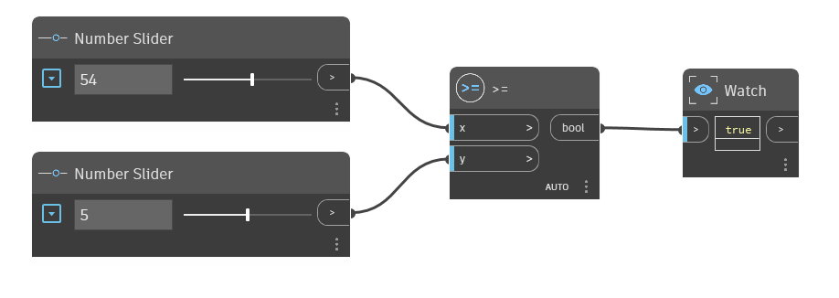

## 详细
“>=”节点是大于或等于运算符。如果“x”输入大于“y”输入，或者如果两个值相等，则存在于 1.x 词典中；编辑的图形名称: GreaterThanOrEqualTo.dyn Y

它返回 True。如果“x”小于“y”，则此运算符返回 False。在下例中，使用“>=”节点确定“x”输入是否大于或等于“y”输入。我们使用两个数字滑块来控制“>=”运算符的输入。
___
## 示例文件

