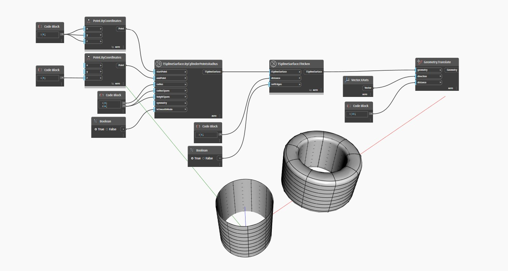

## 详细
`TSplineSurface.Thicken(distance, softEdges)` 沿其面法线按指定的 `distance` 向外(或向内，当提供负的 `distance` 值)加厚 T-Spline 曲面。`softEdges` 布尔输入控制对生成的边进行平滑(true)还是锐化(false)。

在下面的示例中，使用 `TSplineSurface.Thicken(distance, softEdges)` 节点加厚 T-Spline 圆柱曲面。生成的曲面平移到一侧以更好地可视化。
___
## 示例文件

