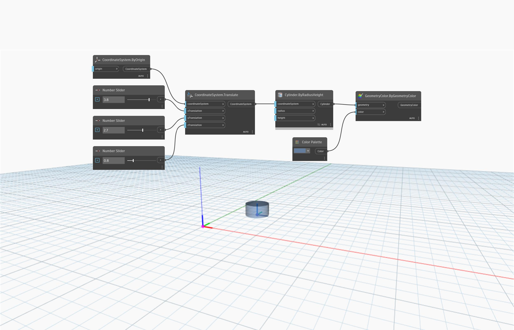

<!--- Autodesk.DesignScript.Geometry.CoordinateSystem.Translate(coordinateSystem, xTranslation, yTranslation, zTranslation) --->
<!--- WC63DIVH2PMDYNEMXAKVSTWOLAWHKDASMASHVO3GK3SW7CAXFLDA --->
## 详细
`CoordinateSystem.Translate (coordinateSystem, xTranslation, yTranslation, zTranslation)` 将返回一个新 CoordinateSystem。其位置基于 X、Y 和 Z 方向上的平移距离。

在下面的示例中，将根据 X 轴上的平移距离 3.8、Y 轴上的平移距离 2.7 和 Z 轴上的平移距离 0.8 返回一个新 CoordinateSystem。新 CoordinateSystem 将使用在其上创建的圆柱体进行标识。

___
## 示例文件

