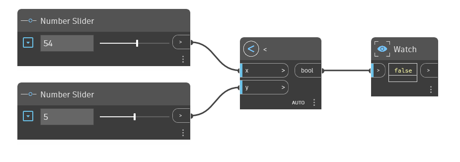

## 深入資訊
`<` 節點是「小於」運算子。如果 `x` 輸入小於 `y` 輸入，則傳回 True。如果 `x` 大於 `y`，或兩個值相等，則此運算子會傳回 False。存在於 1.x 字典中；編輯的圖表名稱: LessThan.dyn Y

在以下範例中，使用 `<` 節點判斷 `x` 輸入是否小於 `y` 輸入。我們使用兩個數字滑棒控制 `<` 運算子的輸入。
___
## 範例檔案

