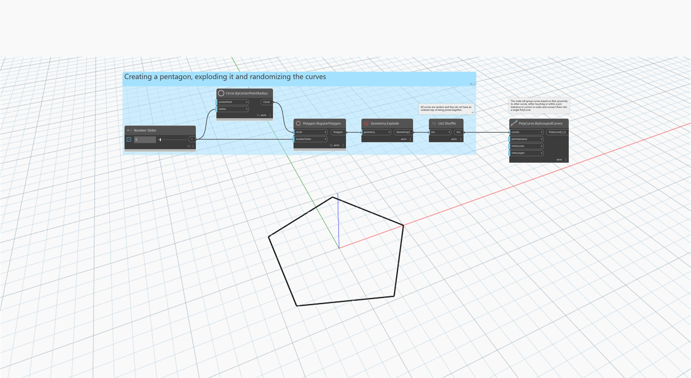

<!--- Autodesk.DesignScript.Geometry.PolyCurve.ByGroupedCurves(curves, joinTolerance, trimCurves, trimLength) --->
<!--- 6Z5ORNUUOKVQFG6ZBYHMWKQR457NCZXFTI27PNFF3MSQGVPTVZ2A --->
## 深入資訊
`PolyCurve.ByGroupedCurves` 會透過將多條連接的曲線分組來建立一條新的 PolyCurve。將曲線分組的方式是根據曲線與其他曲線的接近程度，曲線可以互相接觸，也可以在指定的接合公差內，將這些曲線連接成單一條 PolyCurve。

以下範例分解了一個五邊形，並將曲線隨機化，然後使用 `PolyCurve.ByGroupedCurves` 分組成一條 PolyCurve。
___
## 範例檔案

