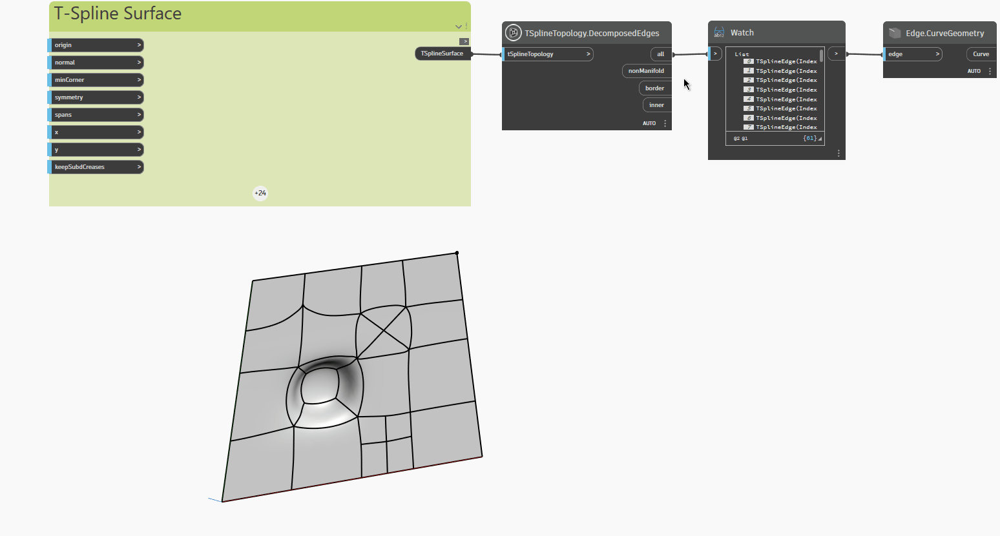

<!--- Autodesk.DesignScript.Geometry.TSpline.TSplineTopology.DecomposedEdges --->
<!--- 7LMFKLQNCV53W7KLS5QWD3E27NGGA33QPHSXMUGH323WVXWJY3GQ --->
## 深入資訊
以下範例使用 `TSplineTopology.DecomposedEdges` 節點檢驗具有擠出、細分和拉伸頂點和面的平面 T 雲形線曲面，此節點會傳回 T 雲形線曲面中包含的以下邊類型清單:

- `all`: 所有邊的清單
- `nonManifold`: 非流形邊的清單
- `border`: 邊界邊的清單
- `inner`: 內側邊的清單

使用 `Edge.CurveGeometry` 節點亮顯曲面不同類型的邊。
___
## 範例檔案

