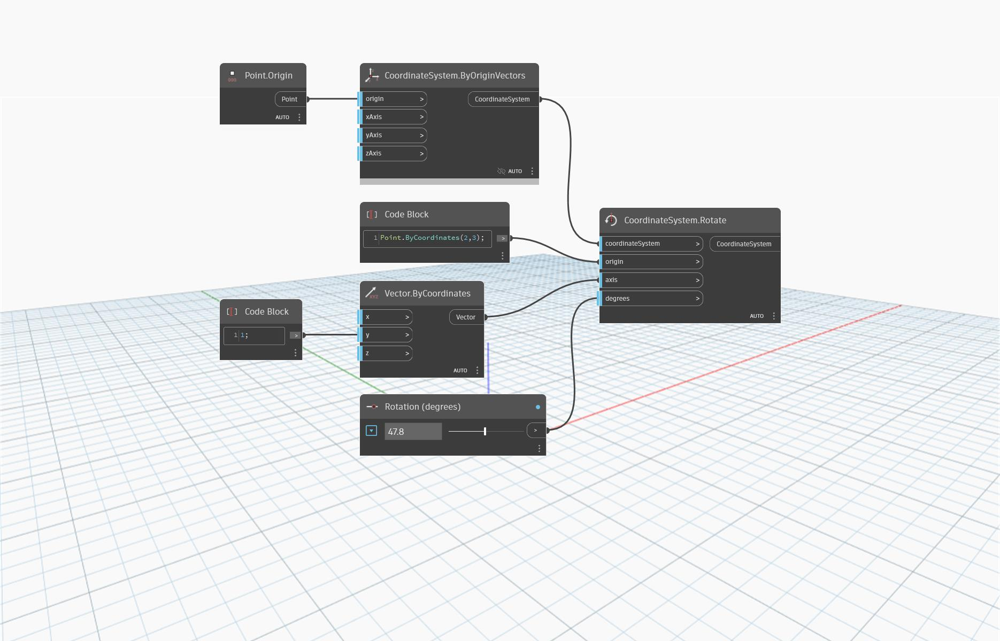

<!--- Autodesk.DesignScript.Geometry.CoordinateSystem.Rotate(coordinateSystem, origin, axis, degrees) --->
<!--- AUJIYC7MERJPYMO5VHIFF7FPJD5YMEBOHOMWKROVKZCF66ZIBZ2A --->
## 深入資訊
`CoordinateSystem.Rotate (coordinateSystem, origin, axis, degrees)` 會傳回繞著原點和向量旋轉的新 CoordinateSystem。

在以下範例中，CoordinateSystem 會繞著原點 (2,0,0) 和相當於 Y 軸的向量旋轉。使用更複雜的向量可以產生更複雜的旋轉。

___
## 範例檔案

