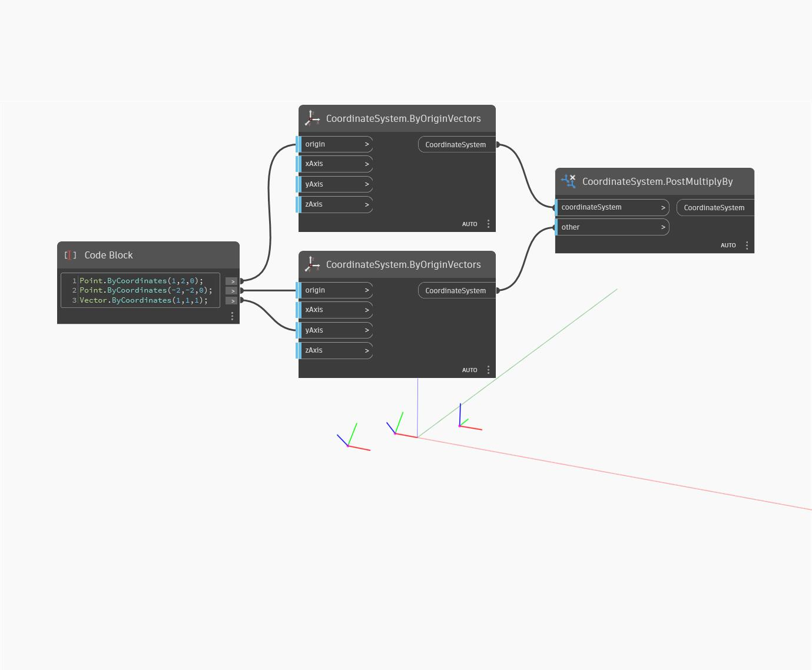

## 深入資訊
PostMultiplyBy 會先乘以一個 CoordinateSystem 再作用 other (引數) CoordinateSystem，而傳回一個新的 CoordinateSystem。在以下範例中，傳回的新 CoordinateSystem 會相對於其相乘及其引數的 CS 平移和旋轉。切換 coordinateSystem 和 other 輸入會產生不同的結果，因為是先作用一個再作用另一個。
___
## 範例檔案

