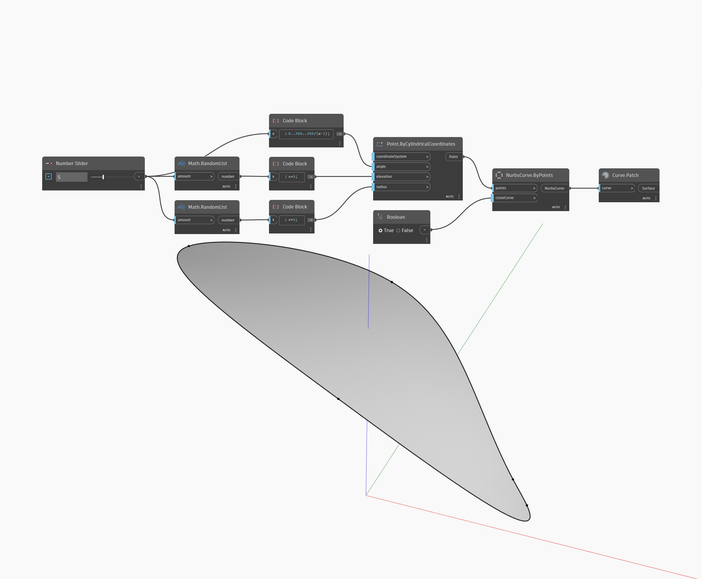

## 深入資訊
Patch 會嘗試使用輸入曲線作為邊界來建立曲面。輸入曲線必須是封閉的。在以下範例中，我們先使用 Point.ByCylindricalCoordinates 節點以設定的間隔在圓當中建立一組點，但高程和半徑是隨機值。然後使用 NurbsCurve.ByPoints 節點根據這些點建立封閉曲線。使用 Patch 節點從邊界封閉曲線建立曲面。請注意，由於點是使用隨機的半徑和高程建立的，因此並非所有排列都會產生可修補的曲線。
___
## 範例檔案

