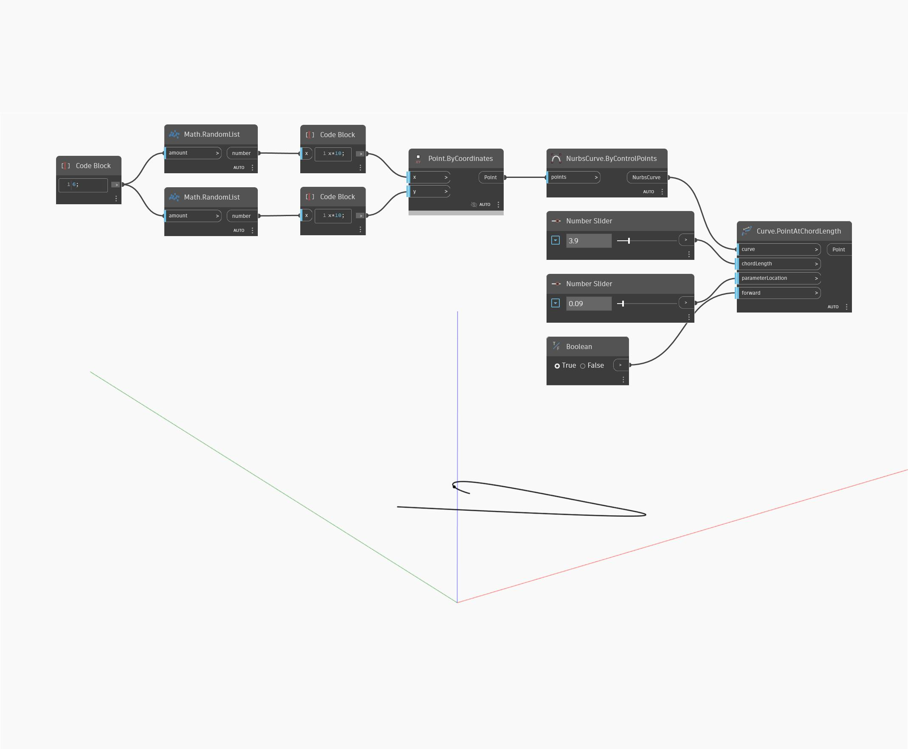

## 深入資訊
PointAtChordLength 會傳回從初始指定的參數開始給定弦長的點。在以下範例中，我們先使用 ByControlPoints 節點，以一組隨機產生的點作為輸入建立一條 Nurbs 曲線。使用一個數字滑棒控制要找出點的直線弦距離。使用設定為範圍 0 到 1 的第二個數字滑棒控制曲線上將從該處開始測量弦距離的初始點。最後，使用布林切換決定從哪個方向測量弦距離。
___
## 範例檔案

