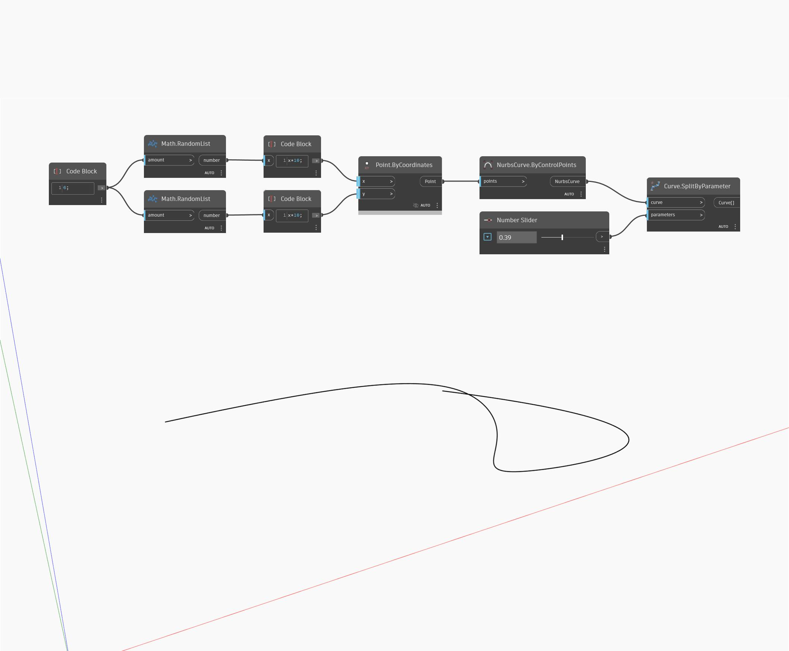

## 深入資訊
`Curve.SplitByParameter (curve, parameters)` 以曲線和參數清單當作輸入，在指定的參數處分割曲線，並傳回產生的曲線清單。

在以下範例中，我們先使用 `NurbsCurve.ByControlPoints` 節點，以一組隨機產生的點作為輸入建立一條 NurbsCurve。使用 Code Block 建立一系列介於 0 到 1 的數字，當作分割曲線的參數清單。

___
## 範例檔案

