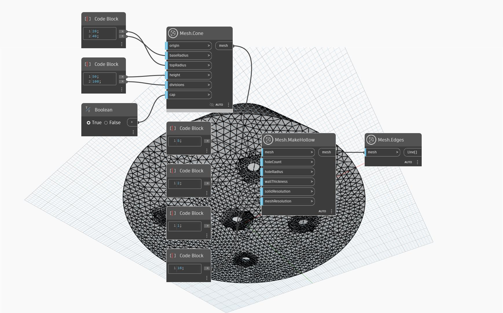

## 深入資訊
使用 `Mesh.MakeHollow` 作業可挖空網格物件以準備進行 3D 列印。挖空網格可以顯著減少所需的列印材料量、列印時間和成本。`wallThickness` 輸入定義網格物件的牆厚度。(可選) `Mesh.MakeHollow` 可以產生材料清除孔，以在列印過程中移除多餘的材料。孔的大小和數量由輸入 `holeCount` 和 `holeRadius` 控制。最後，`meshResolution` 和 `solidResolution` 的輸入會影響網格結果的解析度。`meshResolution` 越高可提高網格內部部分偏移原始網格的準確度，但會產生越多三角形。`solidResolution` 越高，挖空的網格內部部分越能保留原始網格的細節。
以下範例在圓錐形的網格上使用 `Mesh.MakeHollow`。在其底部增加了五個材料清除孔。

## 範例檔案

