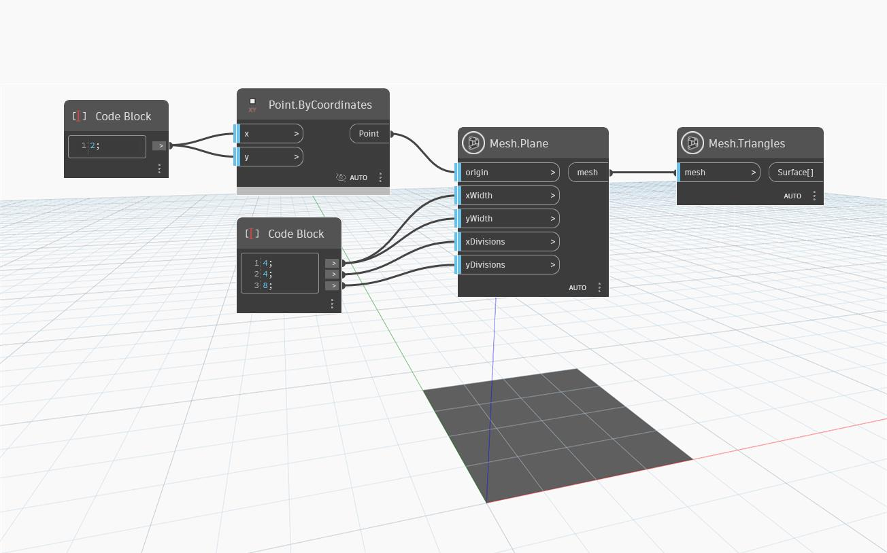

## 深入資訊
`Mesh.Plane` 使用輸入點作為原點，在 x、y 方向給定寬度，以及給定 x、y 劃分數，建立一個平面矩形網格。如果 x 或 y 的劃分數設定為 0，則任一輸入的預設值都會變成 5。

以下範例使用 `Mesh.Plane` 建立一個平面網格，沿著 X 軸有 4 條格線，沿著 Y 軸有 8 條格線。使用 `Mesh.Triangles` 節點顯示網格三角形的分佈。

## 範例檔案

