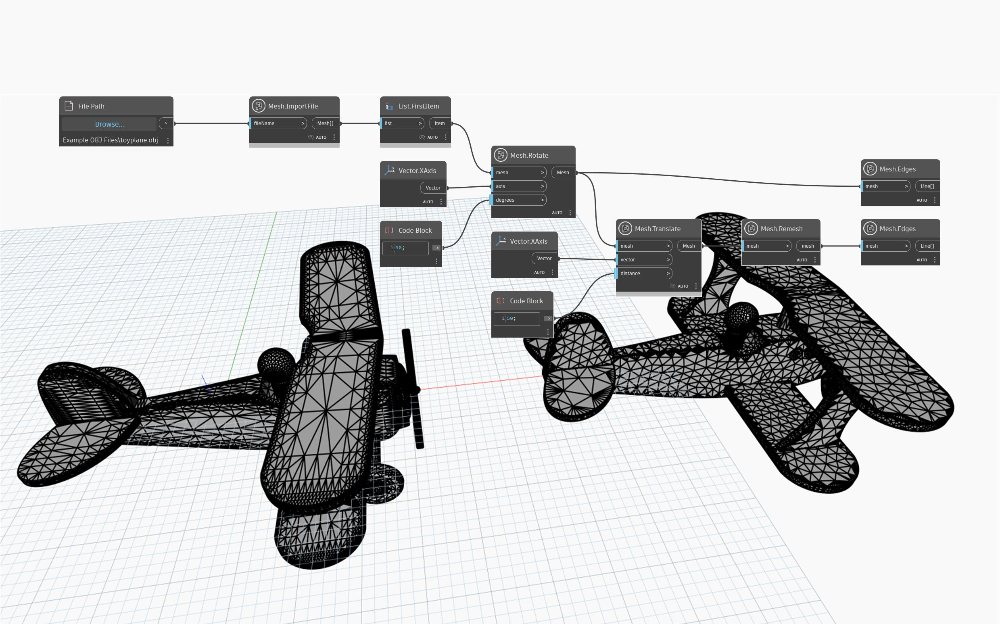

## 深入資訊
`Mesh.Remesh` 會建立給定物件中的三角形更均勻地分佈的新網格，而不管三角形法線是否有任何變化。此作業對於有不同三角形密度的網格很有用，可準備網格進行強度分析。重複對網格重新建立網格，可逐漸產生更均勻的網格。如果是其頂點已經等距的網格 (例如，icosphere 網格)，`Mesh.Remesh` 節點的結果就是同一個網格。
以下範例在細部區域中有高密度三角形的匯入網格上使用 `Mesh.Remesh`。`Mesh.Remesh` 節點的結果會平移到旁邊，然後使用 `Mesh.Edges` 顯示結果。

`(使用的範例檔案依據創用 CC 條款授權)`

## 範例檔案

