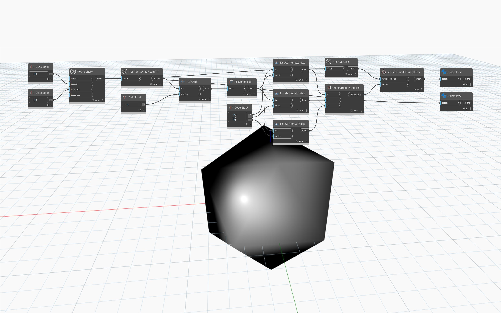

## 深入資訊
`Mesh.VertexIndicesByTri` 會傳回對應到每個網格三角形之頂點索引的展開清單。索引每三個一組排序，使用 `List.Chop` 節點並將 `lengths` 輸入為 3 可以輕鬆地重新建構索引分組。

在以下範例中，`MeshToolkit.Mesh` 的 20 個三角形會轉換為 `Geometry.Mesh`。使用 `Mesh.VertexIndicesByTri` 取得索引清單，然後使用 `List.Chop` 將索引分為三個一組的清單。使用 `List.Transpose` 翻轉清單結構，得到三個頂層清單，每個清單有 20 個索引，對應到每個網格三角形中的點 A、B 和 C。使用 `IndexGroup.ByIndices` 節點建立每個有三個索引的索引群組。然後使用 `IndexGroups` 的結構化清單和頂點清單作為 `Mesh.ByPointsFaceIndices` 的輸入，以獲得轉換後的網格。

## 範例檔案

