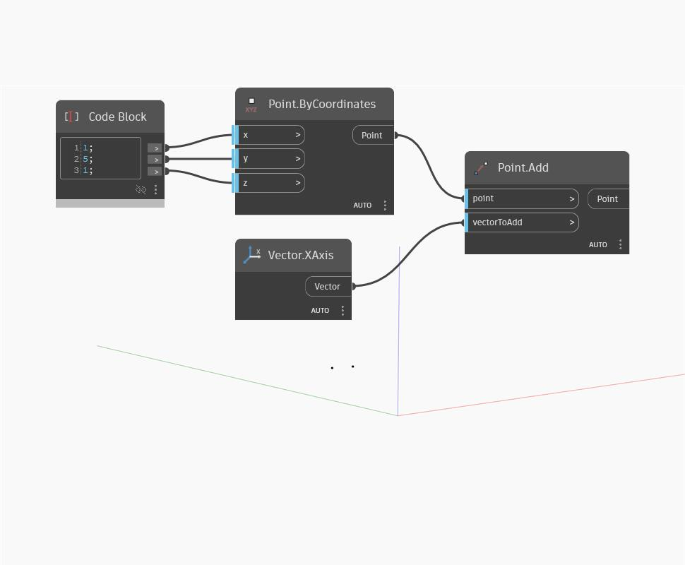

## 深入資訊
`Point.Add` 將輸入點的對應座標加上輸入向量的 x、y、z 分量。這與將點平移給定向量相同，相當於使用 `Geometry.Translate (vector)`。

在以下範例中，我們使用 Code Block 指定 x、y、z 座標，然後加入一個世界 XAxis 向量作為 `vectorToAdd`。結果是沿正 x 方向平移距離 1 的點。

___
## 範例檔案

