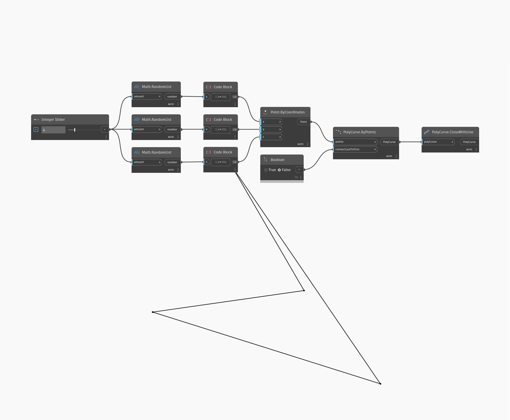

## 深入資訊
CloseWithLine 會在一條開放的 PolyCurve 的起點和終點之間加上一條直線，並傳回包含新增直線的新 PolyCurve。在以下範例中，我們產生一組隨機點，並使用 PolyCuve.ByPoints，將 connectLastToFirst 輸入設定為 false，以建立一條開放的 PolyCurve。將這條 PolyCurve 輸入 CloseWithLine 會建立一條新的封閉 PolyCurve (在此範例中，相當於在 PolyCurve.ByPoints 中對 connectLastToFirst 選項使用「true」輸入)
___
## 範例檔案

