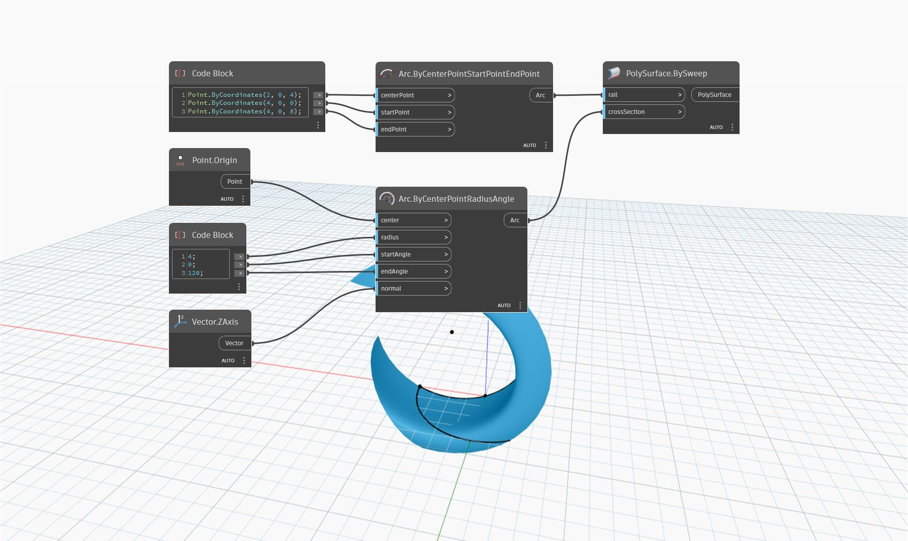

## 深入資訊
`PolySurface.BySweep (rail, crossSection)` 會透過沿著軌跡掃掠連接的非相交線清單來傳回 PolySurface。`crossSection` 輸入可接受在起點或終點必須相接之連接曲線的清單，否則節點不會傳回 PolySurface。此節點與 `PolySurface.BySweep (rail, profile)` 類似，唯一的差異是 `crossSection` 輸入以曲線清單當作輸入，而 `profile` 只以一條曲線當作輸入。

在以下範例中，透過沿著弧掃掠來建立 PolySurface。

___
## 範例檔案

