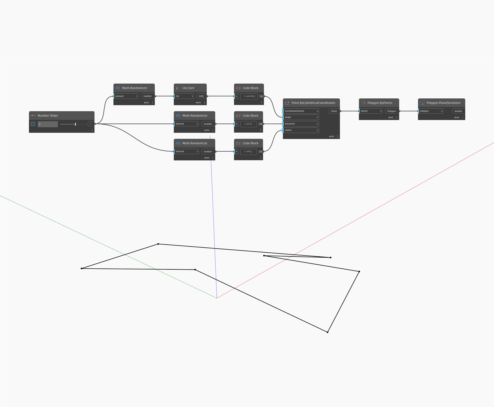

## 深入資訊
PlaneDeviation 會先計算通過給定多邊形的點的最佳擬合平面，然後計算每個點到該平面的距離，以找出各點與最佳擬合平面的最大偏差。在以下範例中，我們產生隨機角度、高程和半徑的清單，然後使用 Points.ByCylindricalCoordinates 建立一組非平面的點用於 Polygon.ByPoints。將此多邊形輸入 PlaneDeviation，我們可以找到各點與最佳擬合平面的平均偏差。
___
## 範例檔案

