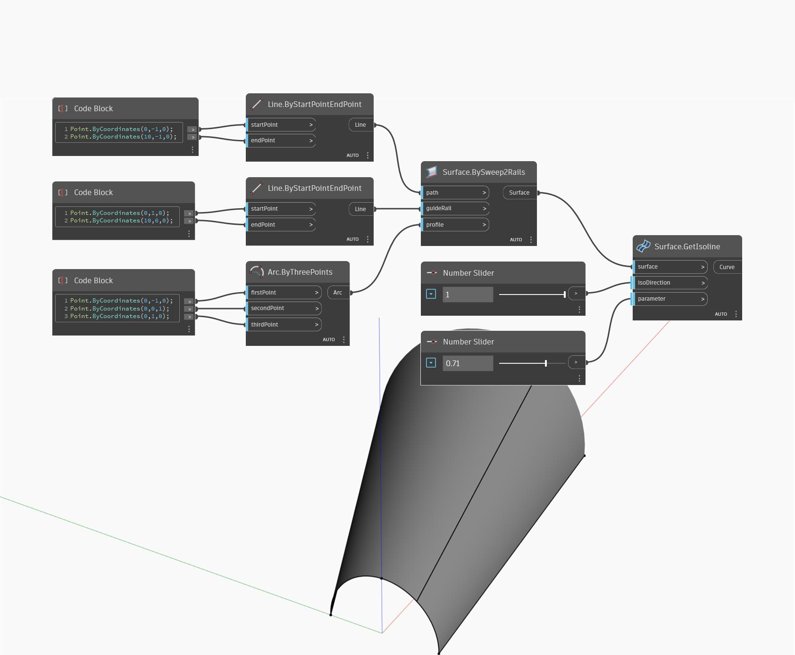

## 深入資訊
GetIsoline 會傳回曲面在輸入 U 或 V 參數處的等值線。使用輸入 isoDirection 決定使用 U 方向還是 V 方向。isoDirection 為 0 對應 U 方向，isoDirection 為 1 對應 V 方向。在以下範例中，我們先使用 BySweep2Rails 建立一個曲面，然後使用兩個數字滑棒。第一個滑棒控制等值線的 U 或 V 方向，第二個滑棒決定要找出等值線的參數。
___
## 範例檔案

