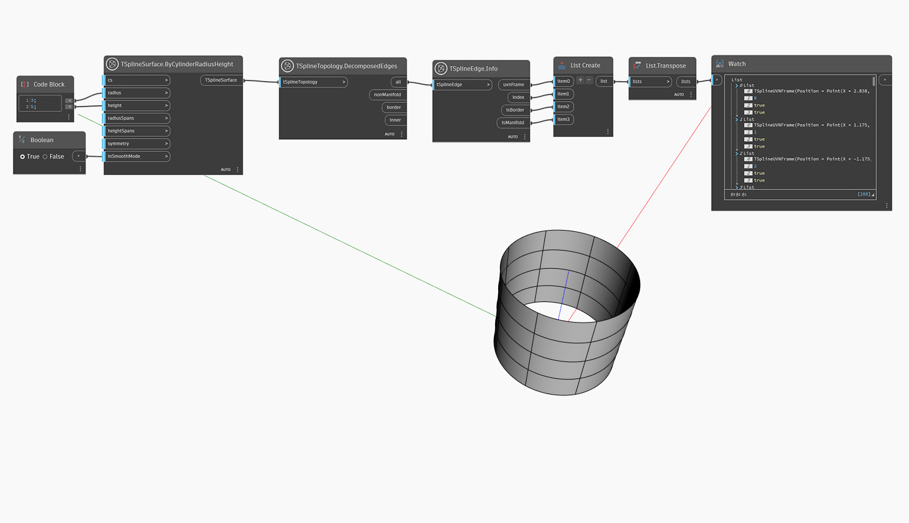

## In-Depth
`TSplineEdge.Info` 會傳回 T 雲形線曲面邊的以下性質:
- `uvnFrame`: 關聯線上的點、U 向量、V 向量和 T 雲形線邊的法線向量
- `index`: 邊的索引
- `isBorder`: 選擇的邊是否為 T 雲形線曲面的邊界
- `isManifold`: 選擇的邊是否為流形

以下範例使用 `TSplineTopology.DecomposedEdges` 取得 T 雲形線圓柱基本型曲面所有邊的清單，使用 `TSplineEdge.Info` 研究其性質。

## 範例檔案

