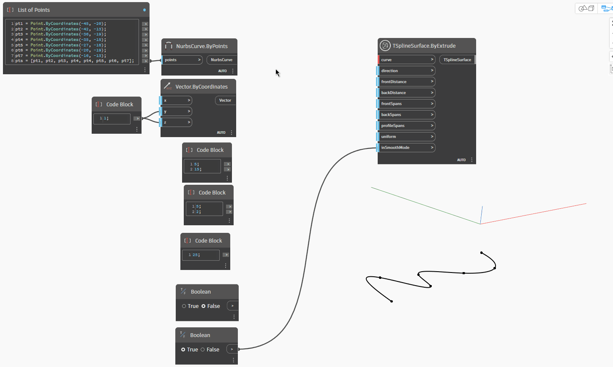

## In-Depth
在以下範例中，透過擠出給定輪廓 `curve` 建立 T 雲形線曲面。曲線可以是開放或封閉。擠出沿提供的 `direction` 進行，也可以沿兩個方向進行，由 `frontDistance` 和 `backDistance` 輸入控制。使用給定的 `frontSpans` 和 `backSpans`，可以分別為兩個擠出方向設定跨距。若要沿曲線建立曲面的定義，`profileSpans` 控制面數，`uniform` 是讓這些面均勻分佈或考慮曲率。最後，`inSmoothMode` 控制曲面以平滑模式還是方塊模式顯示。

## 範例檔案

