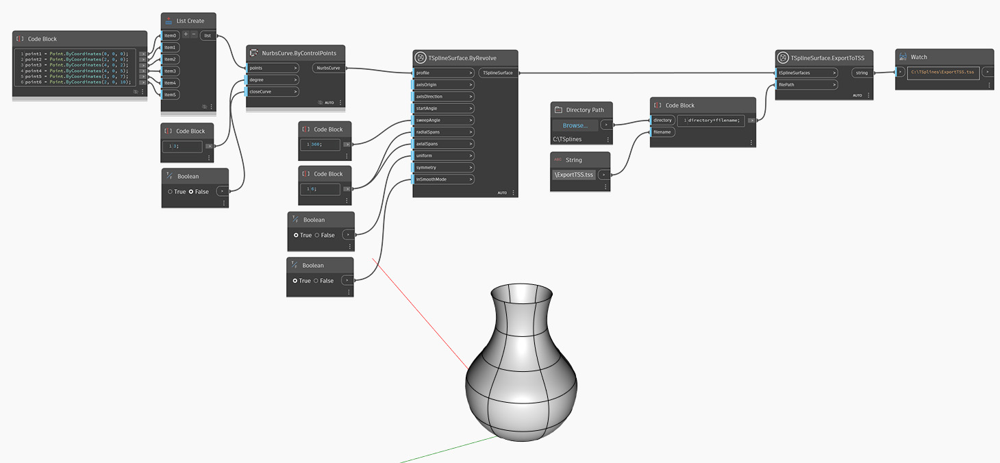

## 深入資訊
In the example below, a T-Spline surface is created using `TSplineSurface.ByRevolve`, with a NURBS curve as a profile.
如果提供檔案路徑，就可以透過 `TSplineSurface.ExportToTSS` 節點將曲面匯出至 T 雲形線場景檔案。
___
## 範例檔案

