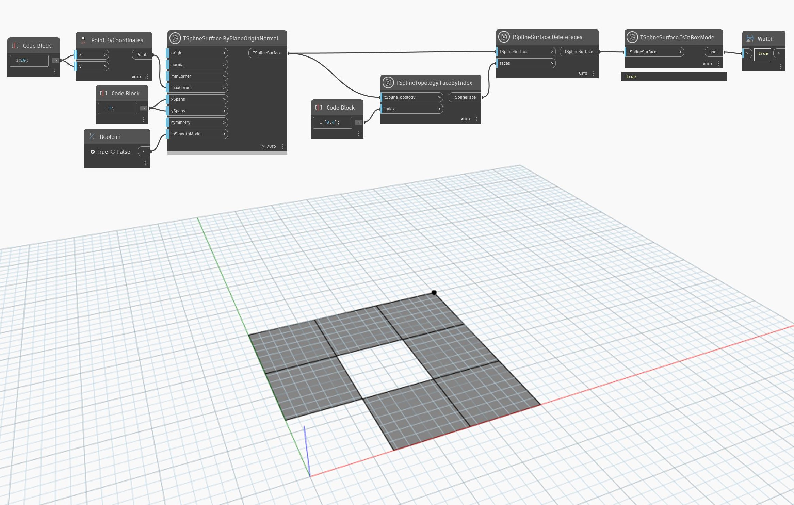

## 深入資訊
方塊模式和平滑模式是兩種檢視 T 雲形線曲面的方式。平滑模式是 T 雲形線曲面的真實形狀，適合預覽模型的美學和尺寸。而方塊模式可以深入清楚地檢視曲面結構，以及更快速預覽大型或複雜幾何圖形。建立初始 T 雲形線曲面時或在建立之後，可以使用 `TSplineSurface.EnableSmoothMode` 之類的節點控制方塊模式和平滑模式。

如果 T 雲形線變成無效，其預覽會自動切換為方塊模式。`TSplineSurface.IsInBoxMode` 節點是另一種識別曲面是否變成無效的方式。

以下範例使用設定為 True 的 `smoothMode` 輸入，建立 T 雲形線平面曲面。之後刪除其中兩個面，讓曲面變成無效。雖然無法單從預覽得知，但曲面預覽會切換為方塊模式。使用 `TSplineSurface.IsInBoxMode` 節點確認曲面處於方塊模式。
___
## 範例檔案

