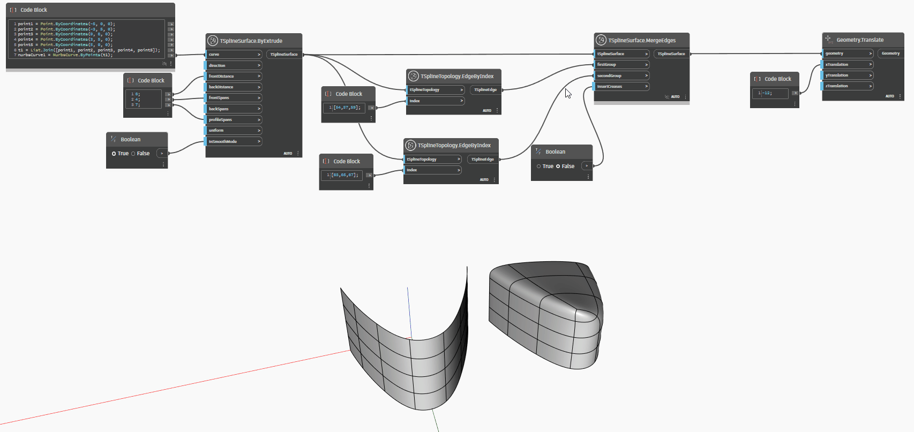

## 深入資訊
以下範例透過擠出 NURBS 曲線建立 T 雲形線曲面。使用 `TSplineTopology.EdgeByIndex` 節點選取其六條邊 - 形狀每邊三條。將這兩組邊以及曲面傳入 `TSplineSurface.MergeEdges` 節點。邊群組的順序會影響形狀 - 第一組邊會位移以與第二組邊相接，第二組邊會留在相同位置。`insertCreases` 輸入增加沿合併邊讓接縫變縐摺的選項。合併作業的結果會平移到旁邊方便預覽。
___
## 範例檔案

