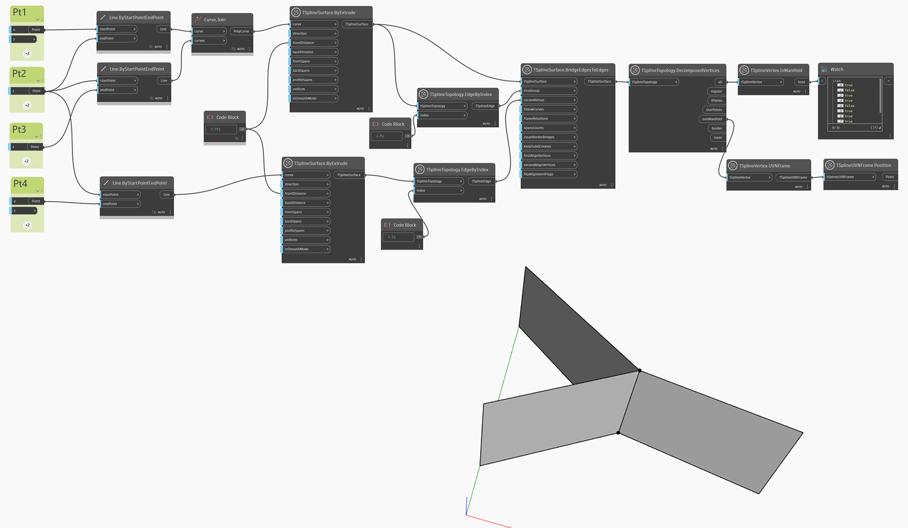

## In-Depth
以下範例透過接合兩個共用內部邊的曲面產生一個非流形曲面。結果是一個沒有明顯前後的曲面。非流形曲面在修復之前只能以方塊模式顯示。使用 `TSplineTopology.DecomposedVertices` 查詢曲面的所有頂點，使用 `TSplineVertex.IsManifold` 節點亮顯哪些頂點符合流形的條件。使用 `TSplineVertex.UVNFrame` 和 `TSplineUVNFrame.Position` 節點擷取非流形頂點並顯示位置。

## 範例檔案

