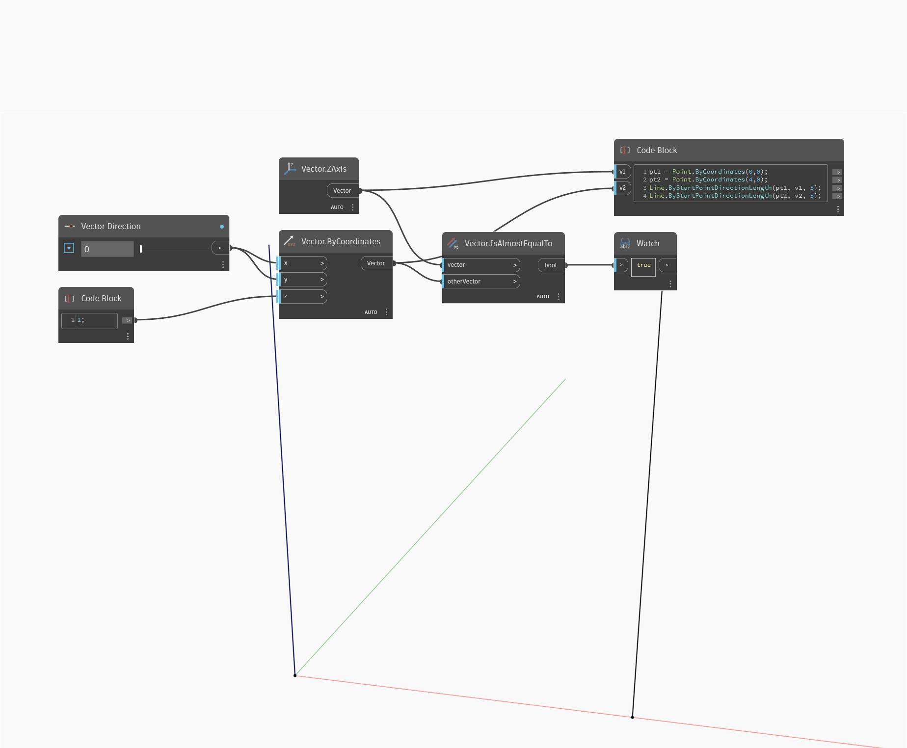

## In Depth
IsAlmostEqualTo will return a boolean value based on whether a Vector has the same values as another. In the example below, a true value is returned when comparing a Vector on the WCS Z axis to a Vector with coordinates of (0,0,1). Adjusting the Vector Direction slider will change the Vector's coordinate values making it unequal. The Vectors are represented as Lines.
___
## Example File

