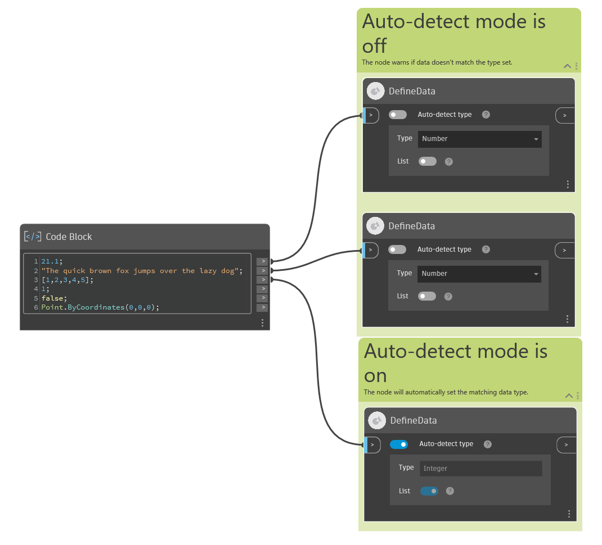

## 深入資訊

Define Data 節點會驗證進入資料的資料類型。可用來確保本地資料是所需的類型，而且也設計用來作為輸入或輸出節點，宣告圖表預期或提供的資料類型。節點支援選取常用的 Dynamo 資料類型，例如「String」、「Point」和「Boolean」。節點的下拉式功能表中有完整的支援資料類型清單。此節點支援單一值或展開清單形式的資料。不支援巢狀清單、字典和複製。

### 行為

節點會根據「類型」下拉式功能表和「清單」切換開關的設定來驗證從輸入埠進入的資料 (請參閱下方瞭解細節)。如果驗證成功，則節點的輸出與輸入相同。如果驗證不成功，節點將進入輸出為空值的警告狀態。
節點有一個輸入:

-   「**>**」輸入 - 連接到上游節點以驗證其資料類型。
    節點另外提供三個使用者控制項:
-   **自動偵測類型**切換開關 - 如果開啟，節點會分析進入的資料，如果資料是支援的類型，節點會根據進入的資料設定「類型」和「清單」控制項的值。「類型」下拉式功能表和「清單」切換開關會停用並根據輸入節點自動更新。

    如果「自動偵測類型」關閉，您可以使用「類型」功能表和「清單」切換開關指定資料類型。如果進入的資料不符合您指定的類型，節點將進入輸出為空值的警告狀態。
-   **類型**下拉式功能表 - 設定預期的資料類型。如果控制項啟用 (**自動偵測類型**切換開關處於關閉狀態)，則會設定要驗證的資料類型。如果控制項停用 (**自動偵測類型**切換開關處於開啟狀態)，則會根據進入的資料自動設定資料類型。如果資料類型完全符合顯示的類型，或屬於顯示類型的子系 (例如，如果「類型」下拉式功能表設定為「曲線」，則「矩形」、「線」等類型的物件有效)，則資料是有效的。
-   **清單**切換開關 - 如果開啟，節點會預期進入的資料是包含有效資料類型項目的單一展開清單 (請參閱上方)。如果關閉，節點會預期是有效資料類型的單一項目。

### 用作輸入節點

如果設定為輸入 (節點的關聯式功能表中為「是輸入」)，節點可以選擇性使用上游節點設定輸入的預設值。執行圖表時會快取 Define Data 節點的值，供外部執行圖表 (例如使用 Engine 節點) 時使用。

## 範例檔案

在以下範例中，第一組「DefineData」節點關閉**自動偵測類型**切換開關。此節點會正確驗證提供的 Number 輸入，同時拒絕 String 輸入。第二組包含開啟**自動偵測類型**切換開關的節點。此節點會自動調整「類型」下拉式功能表和「清單」切換開關以符合輸入 (在此範例中為整數清單)。

