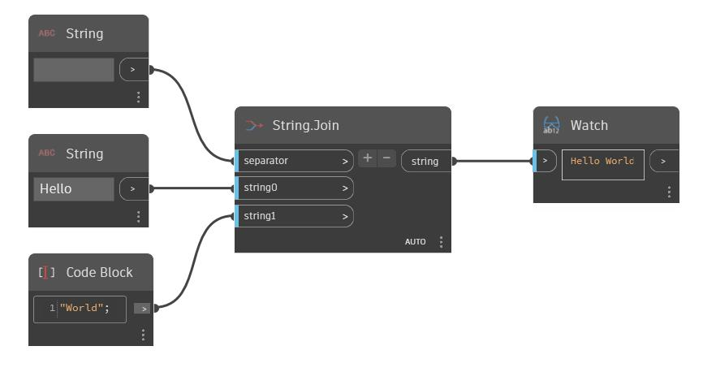

## 深入資訊
String 節點可讓使用者輸入字串值。也可以使用 Code Block 將字串括在引號中建立字串。在以下範例中，我們使用一個 String 節點和 Code Block 建立字串「Hello」和「World」。使用 String.Join 節點將這兩個字串結合在一起。使用另一個 String 節點將空格作為分隔符號，產生輸出字串「Hello World」。
___
## 範例檔案

