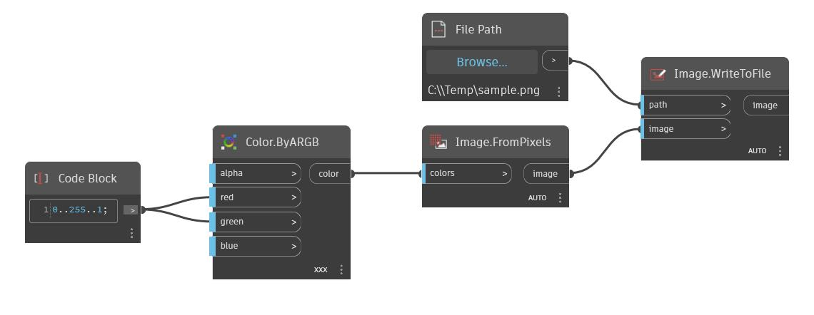

## 深入資訊
WriteToFile 會傳回寫入 Excel 檔案之清單的清單。將要寫入資料的工作表名稱、開始列和開始欄定義為輸入，以及是否覆蓋既有資料。在以下範例中，從第 0 列 (或 Excel 中的第 1 列) 和第 1 欄 (或 Excel 中的 B 欄) 開始，將包含數列之清單的清單寫入 sampleexcel.xlsx。Excel 檔案現在有九個新欄，資料在既有的兩列中。寫入 sampleexcel.xlsx 前後的螢幕快照顯示 Excel 格式的資料。
___
## 範例檔案

