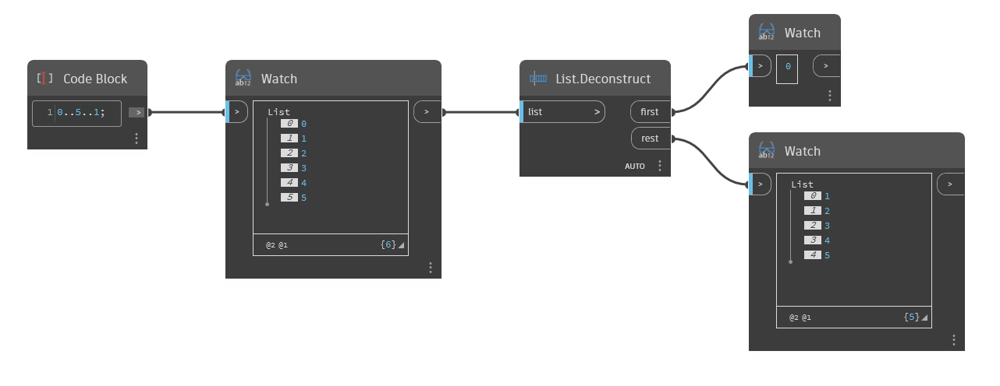

## 深入資訊
`List.Deconstruct` 會將清單中的第一個項目與剩餘項目分開。此節點有兩個輸出。第一個輸出是原始清單的第一個項目。第二個輸出是包含原始清單中剩餘元素的清單。

在以下範例中，我們先使用 Code Block 產生一個從 0 到 5，以 1 遞增的數字範圍。然後使用 `List.Deconstruct` 節點將第一個項目與剩餘項目分開。結果是項目 0 為第一個輸出，1 到 5 的清單為第二個輸出。
___
## 範例檔案

