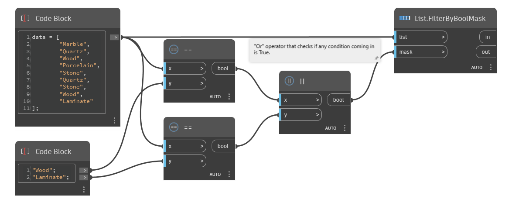

## 深入資訊
`List.FilterByBoolMask` 接受兩個清單作為輸入。第一個清單會根據布林 (True 或 False) 值的對應清單分成兩個單獨的清單。`list` 輸入中對應到 `mask` 輸入中 True 的項目，會導向到標示為 in 的輸出，而對應到 False 值的項目會導向到標示為 `out` 的輸出。

在以下範例中，使用 `List.FilterByBoolMask` 從材料清單中挑出 wood 和 laminate。我們先比較兩個清單找出相符的項目，接著使用 `Or` 運算子檢查是否有 True 清單項目，再根據項目是 wood、laminate 還是其他內容篩選清單項目。
___
## 範例檔案

