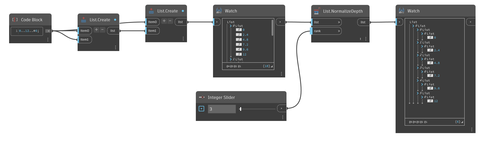

## 深入資訊
`List.NormalizeDepth` 會傳回到指定等級 (也就是清單深度) 都有一致深度的新清單。

與 `List.Flatten` 類似，您可以使用 `List.NormalizeDepth` 傳回一維清單 (有一層的清單)。但您也可以使用它增加清單層數。此節點會將輸入清單標準化為您選擇的深度。

在以下範例中，使用整數滑棒可將包含 2 個不等深清單的清單標準化到不同等級。透過標準化不同等級的深度，清單會增加或減少深度，但永遠是均勻的。等級 1 的清單會傳回一個元素清單，等級 3 的清單會傳回 2 層的子清單。
___
## 範例檔案

