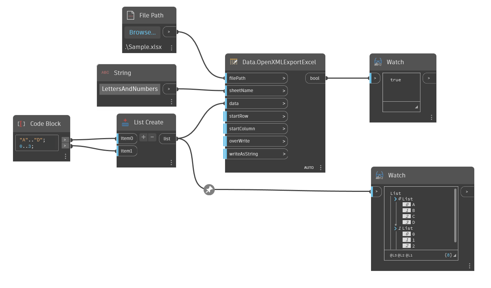

## 深入資訊
Data.OpenXMLExportExcel 使用 OpenXML 標準將資料寫入 Microsoft Excel。此版本的 Excel 節點不需要在電腦上安裝 Excel。overWrite 和 writeAsString 是有預設值的可選輸入。overWrite 會取代 Excel 檔案中所有的內容，writeAsString 會強制所有資料以字串呈現。
___
## 範例檔案

