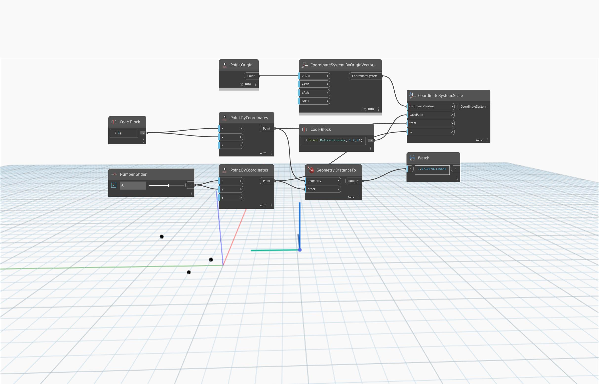

<!--- Autodesk.DesignScript.Geometry.CoordinateSystem.Scale(coordinateSystem, basePoint, from, to) --->
<!--- DXEUCQG4Y4M6N76367ZJYZYJJOLPKVDC5UFPTIBMDW6CC5ORFAXQ --->
## 深入資訊
`CoordinateSystem.Scale (coordinateSystem, basePoint, from, to)` 會根據要調整比例的基準點、要調整比例的起點，以及要調整比例的終點，傳回調整比例後的 CoordinateSystem。`basePoint` 輸入定義開始調整比例的位置 (CoordinateSystem 移動的量)。`from` 和 `to` 兩點之間的距離定義要調整的比例量。

在以下範例中，`basePoint` (-1, 2, 0) 定義要開始調整比例的位置。`from` (1, 1, 0) 和 `to` (6, 6, 0) 兩點之間的距離決定要調整的比例。

___
## 範例檔案

