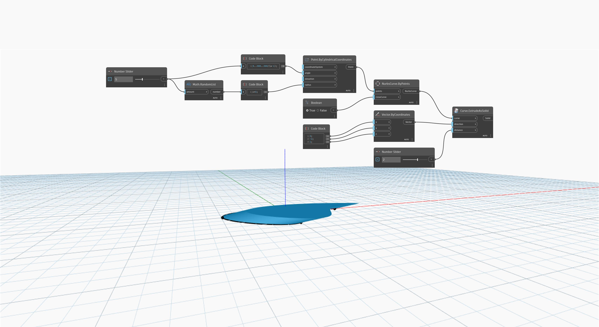

<!--- Autodesk.DesignScript.Geometry.Curve.ExtrudeAsSolid(curve, direction, distance) --->
<!--- EXQDCVFI3OT5SKR7TAAZHHPRQTFTGPSESCN2SXOJLSORL2ATIOCA --->
## 深入資訊
Curve.ExtrudeAsSolid (direction, distance) 使用輸入向量決定擠出方向，將輸入的封閉平面曲線擠出。使用單獨的 `distance` 輸入作為擠出距離。此節點會將擠出的兩端覆蓋以建立實體。

在以下範例中，我們先使用 `NurbsCurve.ByPoints` 節點建立 NurbsCurve，並使用一組隨機產生的點作為輸入。使用 `code block` 指定 `Vector.ByCoordinates` 節點的 X、Y 和 Z 分量，然後使用此向量作為 `Curve.ExtrudeAsSolid` 節點的 `direction` 輸入，同時使用數字滑棒控制 `distance` 輸入。
___
## 範例檔案

